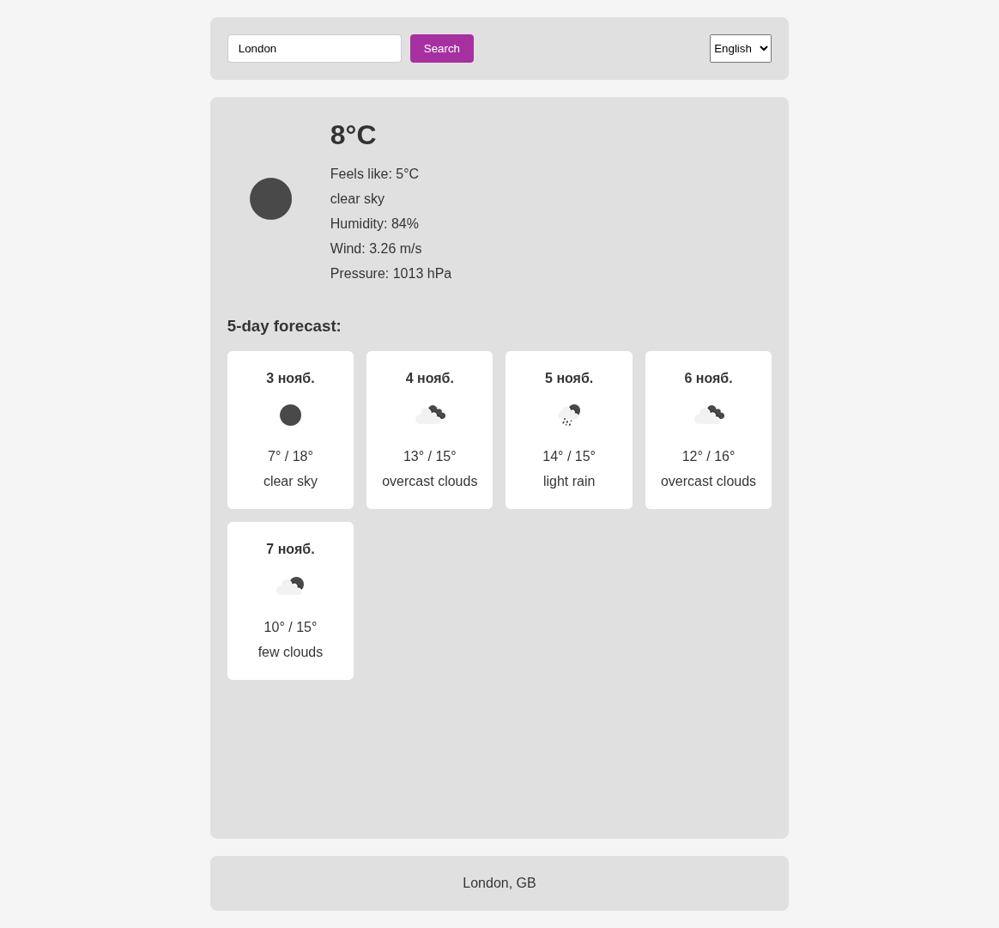
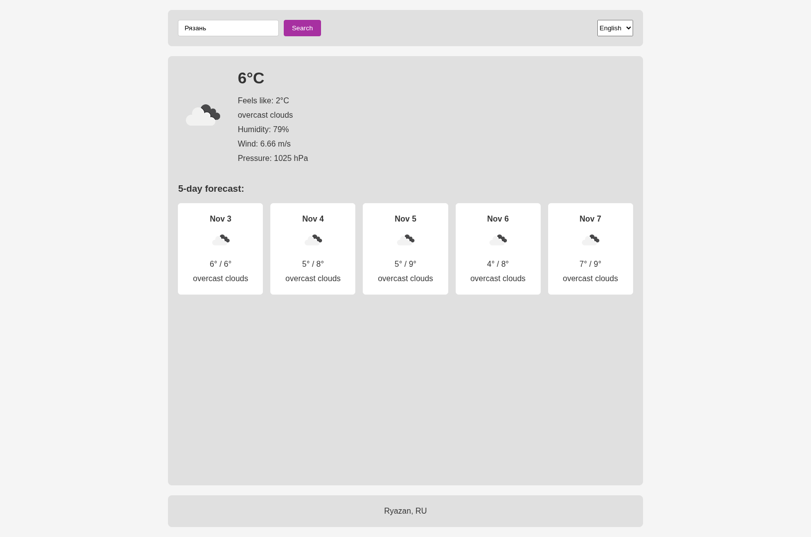

# weather-app

Простое приложение для просмотра прогноза погоды

## Быстрый старт

### Бэкенд
```bash
# Установи зависимости
npm install

# Создай .env файл с API ключом
echo "API_KEY=your_openweather_api_key" > .env

# Запусти сервер
npm start
```
### Фронтенд
Просто открой index.html файл в браузере или запусти через Live Server

# Технологии

## Бэкенд
* express
* nodejs
* кэширование
## Фронтенд
* html
* css
* JavaScript

# Настройка

* Получи API ключ на OpenWeatherMap
* Добавь его в .env файл
* Запусти бэкенд и открой фронтенд

# Скриншоты
## Главная страница

## Пример работы

